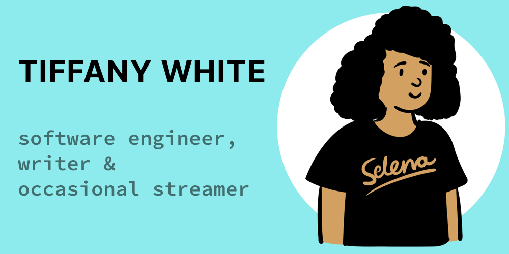

  

Hey.  I'm Tiffany.

I'm a software engineer working on the web, and figuring my way around servers and the backend of web apps.

I'm excited about serverless tooling and managing Linux servers and networking, and earning my bug bounty stripes through pentesting on my LAN.

## Recent Posts 📝

<!--START_SECTION:feed-->
* [The Beautiful Mess That is Webflow](https:&#x2F;&#x2F;www.tiffanywhite.dev&#x2F;2021&#x2F;12&#x2F;11&#x2F;the-beautiful-mess-that-is-webflow&#x2F;)
* [Blog Posts on My Career and Work at Calaxy](https:&#x2F;&#x2F;www.tiffanywhite.dev&#x2F;2021&#x2F;09&#x2F;23&#x2F;blog-posts-on-my-career-and-work-at-calaxy&#x2F;)
* [New Opportunities](https:&#x2F;&#x2F;www.tiffanywhite.dev&#x2F;2021&#x2F;09&#x2F;10&#x2F;new-opportunities&#x2F;)
* [A Year of Reflection and a Year to Move Forward](https:&#x2F;&#x2F;www.tiffanywhite.dev&#x2F;2021&#x2F;01&#x2F;07&#x2F;a-year-of-reflection-and-a-year-to-move-forward&#x2F;)
* [Building a Static Site Generator with Ruby](https:&#x2F;&#x2F;www.tiffanywhite.dev&#x2F;2020&#x2F;12&#x2F;17&#x2F;building-a-static-site-generator-with-ruby&#x2F;)
<!--END_SECTION:feed-->

## Recent Newsletters 📰

<!--START_SECTION:newsletters-->
* [The Nerd&#x2F;Marketer Dichotomy](https:&#x2F;&#x2F;news.tiffanywhite.dev&#x2F;archive&#x2F;the-nerdmarketer-dichotomy&#x2F;)
* [Sometimes Sh!t Happens](https:&#x2F;&#x2F;news.tiffanywhite.dev&#x2F;archive&#x2F;sometimes-sht-happens&#x2F;)
* [New Job, Great Opportunities](https:&#x2F;&#x2F;news.tiffanywhite.dev&#x2F;archive&#x2F;new-job-great-opportunities&#x2F;)
* [Hitting My Stride, Routines, and Applying Again](https:&#x2F;&#x2F;news.tiffanywhite.dev&#x2F;archive&#x2F;hitting-my-stride-routines-and-applying-again&#x2F;)
* [Other&#39;s Success Can Push You Towards Your Own](https:&#x2F;&#x2F;news.tiffanywhite.dev&#x2F;archive&#x2F;others-success-can-push-you-towards-your-own&#x2F;)
<!--END_SECTION:newsletters-->

## Some of my social stuff/links 🔗 💬

  &nbsp;&nbsp;
 <a href="https://timeline.tiffanyrwhite.com">
  &nbsp;&nbsp;
  &nbsp;&nbsp;
  
   
  &nbsp;&nbsp;
  &nbsp;&nbsp;
  
  &nbsp;&nbsp;
  &nbsp;&nbsp;
  &nbsp;&nbsp;

![Metrics](https://metrics.lecoq.io/twhite96?template=classic&isocalendar=1&languages=1&stargazers=1&lines=1&stars=1&habits=1&followup=1&achievements=1&notable=1&traffic=1&wakatime=1&base=header%2C%20activity%2C%20community%2C%20repositories%2C%20metadata&base.indepth=false&base.hireable=false&isocalendar=false&isocalendar.duration=half-year&languages=false&languages.ignored=html%2C%20css&languages.limit=5&languages.threshold=0%25&languages.other=false&languages.colors=github&languages.sections=most-used&languages.indepth=false&languages.analysis.timeout=15&languages.categories=markup%2C%20programming&languages.recent.categories=markup%2C%20programming&languages.recent.load=300&languages.recent.days=14&stargazers=false&stargazers.charts=true&stargazers.charts.type=classic&stargazers.worldmap=false&stargazers.worldmap.sample=0&lines=false&lines.sections=base&lines.repositories.limit=4&lines.history.limit=1&stars=false&stars.limit=4&habits=false&habits.from=200&habits.days=14&habits.facts=true&habits.charts=false&habits.charts.type=classic&habits.trim=false&habits.languages.limit=8&habits.languages.threshold=0%25&followup=false&followup.sections=repositories&followup.indepth=false&followup.archived=true&achievements=false&achievements.threshold=C&achievements.secrets=true&achievements.display=detailed&achievements.limit=0&notable=false&notable.from=organization&notable.repositories=false&notable.indepth=false&notable.types=commit&traffic=false&wakatime=false&wakatime.url=https%3A%2F%2Fwakatime.com&wakatime.user=tiffanywhitedev&wakatime.sections=time%2C%20projects%2C%20projects-graphs%2C%20languages%2C%20languages-graphs%2C%20editors%2C%20os&wakatime.days=7&wakatime.limit=5&wakatime.languages.other=false&wakatime.repositories.visibility=all&config.timezone=America%2FNew_York)
