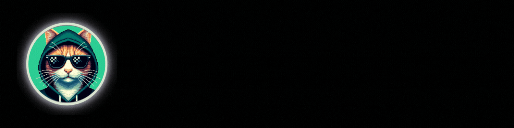

  

Hi! I'm tiff a lifelong lover of all things that creep in the shadows. I was a frontend developer in another life and while I was able to make good money and do challenging work, it wasn't my jam. So I've pivoted to cybersecurity.

  
  
  

## Solid Skills

  

## Skills I am learning for the transition into cybersecurity

  

## Some of my social stuff/links 🔗 💬

  &nbsp;&nbsp;
  &nbsp;&nbsp;
  &nbsp;&nbsp;
  &nbsp;&nbsp;
  &nbsp;&nbsp;
   

---

